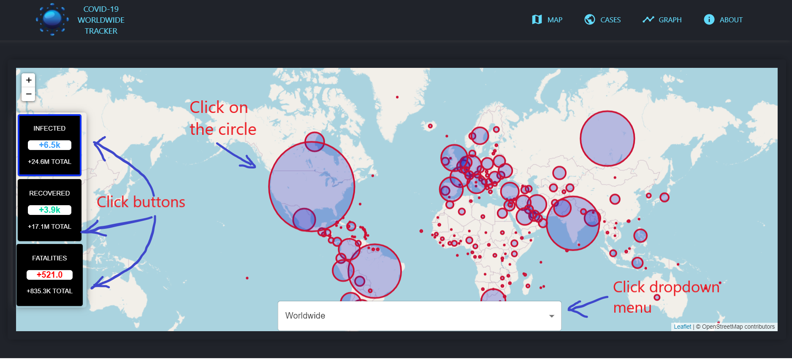
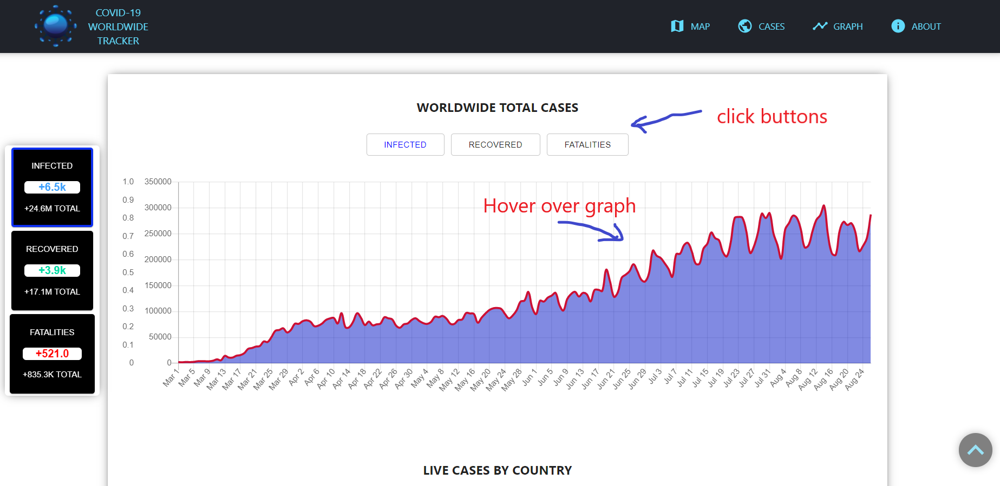
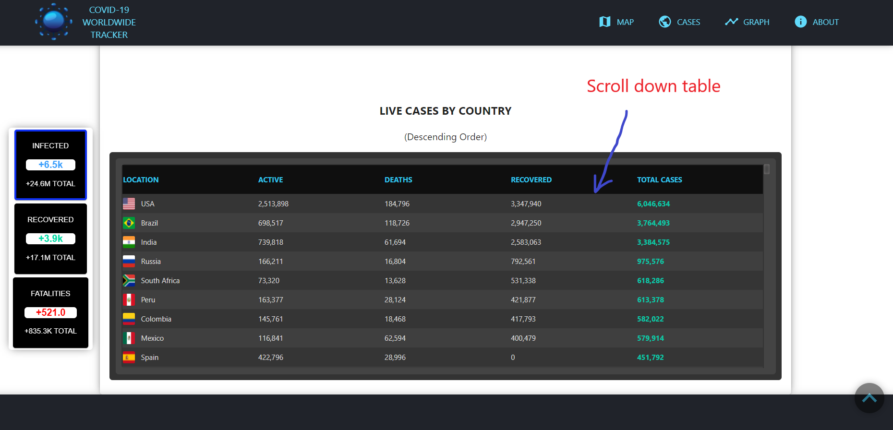
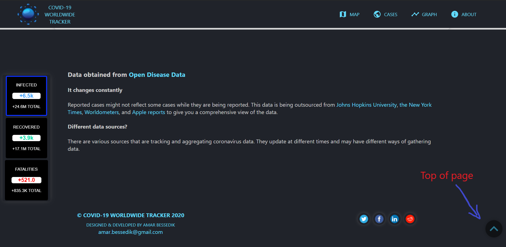
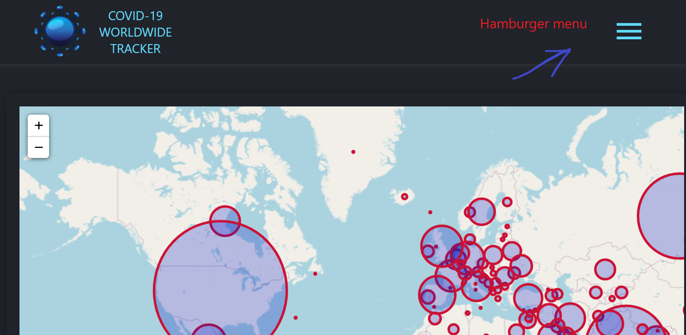
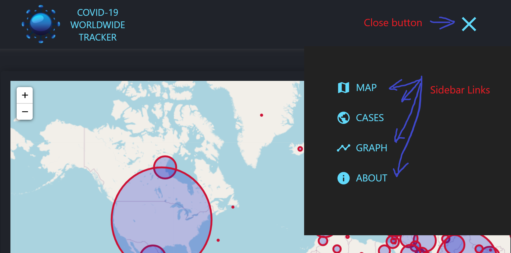

**This project is a React web application for worldwide COVID-19 tracking in real time.** 

1. It features a map to show a visual representation by location of infections, recovered patient data and fatalities through circles and toltips. 

2. It contains a dropdown menu to look for a specific country data as well as global totals.

3. It also features a graphical representaion of the cases in 3 areas for each country: INFECTIONS, RECOVERED, & DEATHS.

4. Finally a table that lists all cases from every country.

**Screenshots of the application:**

**Map:**

**Graph:**

**Table:**

**About Data:**

**Mobile -> Hamburger menu:**

**Mobile -> Side menu links:**

